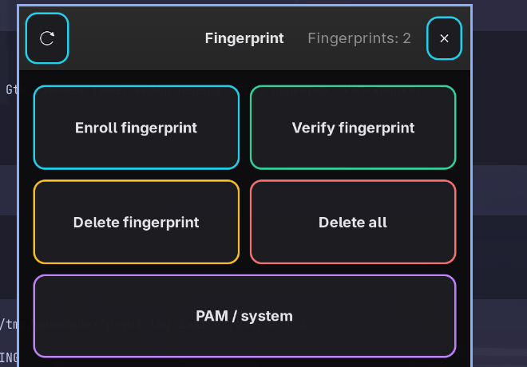

# Fingerprint — fingerprint manager for Huawei/Honor laptops

TUI (`fngrmngr`) + GTK GUI (`fngrmngr-gui`) for enrolling, verifying and
deleting fingerprints via `fprintd`, with per-service PAM toggles
(sudo, login, lock screen…). Written for Huawei/Honor laptops, whose
fingerprint sensor is the same across models (see Step 0).



> **Works on any Linux.** The tools are plain bash + Python/GTK and only
> need `fprintd`, `libfprint` and `python-gobject` from your distro's
> repositories — Arch, Debian (tested by the author on real hardware),
> Ubuntu, Fedora (`sudo dnf install fprintd fprintd-pam python3-gobject
> gtk3`), openSUSE, anything. No Omarchy, no desktop-specific daemons
> required.

## Step 0. Sensor: identify it, flash firmware if needed

Huawei/Honor laptops (MateBook D14/D15, Honor MagicBook 14/15/Pro and
siblings, AMD and Intel alike — the sensor and drivers don't care about
the CPU) ship the same sensor:

```
$ lsusb | grep -i finger
Bus 001 Device 005: ID 27c6:5110 Shenzhen Goodix Technology Co.,Ltd. ...
```

`27c6:5110` = Goodix TLS sensor, handled by libfprint's `goodixmoc` driver
(libfprint ≥ 1.94). Run `./check-sensor.sh` first — it identifies the reader
and tells you the firmware path. Quick reference:

| Sensor (USB VID) | Examples | Firmware flashable? |
|---|---|---|
| Goodix `27c6` | 5110 (Huawei/Honor), 6001, 6496 | **Yes**, via fwupd `goodix-moc` plugin **if** the vendor published firmware on LVFS. `27c6:5110` TLS normally works with stock libfprint, no flash needed; early community TLS forks required a one-time flash with the `goodix-fp-dump` tool |
| Synaptics Prometheus `06cb` | 00a9, 00a2 (ThinkPads…) | **Yes**, via fwupd `synaptics-prometheus` plugin if LVFS carries it |
| ELAN `04f3` | elan / elanmoc devices | **No** fwupd path — works out of the box or not at all; keep libfprint fresh |
| Validity `138a` | legacy 00xx | **No** — mostly unsupported by libfprint, no flash path |
| FPC `10c4` / EgisTec `1c7a` | fpcmoc / egismoc devices | **No** fwupd path (drivers exist in libfprint) |

If `fprintd-list` reports *no devices found* on a flashable sensor, pull
firmware from LVFS first:

```bash
sudo pacman -S fwupd            # or: sudo apt install fwupd
fwupdmgr refresh --force
fwupdmgr get-devices            # look for your fingerprint reader
fwupdmgr update                 # applies vendor firmware if offered
reboot
```

After reboot `fprintd-list "$USER"` should show the device.

## Quick start (one-shot per distro)

```bash
./enroll/enroll.sh
```

Detects your distro and runs the right script: deps install → finger enroll
→ PAM enable (Arch: direct files with backups; Debian/Ubuntu: `pam-auth-update`;
Fedora: `authselect`). Details for each path are below if you prefer manual steps.

## Step 1. Stack (manual)

```bash
# Arch
sudo pacman -S fprintd libfprint python-gobject gtk3
# Debian/Ubuntu
sudo apt install fprintd libpam-fprintd python3-gi gir1.2-gtk-3.0
# Fedora
sudo dnf install fprintd fprintd-pam python3-gobject gtk3
```

Check: `fprintd-list "$USER"` → device line, no fingerprints yet.

## Step 2. Install these tools (no root)

```bash
./install.sh
```

Installs `fngrmngr` (terminal UI) and `fngrmngr-gui` (GTK app, menu name
“Fingerprint”) to `~/.local/bin`, plus the desktop entry and icons.

## Step 3. Enroll fingers

GUI: open **Fingerprint**, pick a numbered finger (1–10), confirm with your
**sudo password** (adding/deleting never uses the fingerprint itself, so a
half-enrolled finger can't lock you out). Or terminal:

```bash
fprintd-enroll -u "$USER" -f right-index-finger
fprintd-list "$USER"      # verify it is stored
fprintd-verify            # test it
```

## Step 4. Enable in PAM (needs root, in a terminal)

```bash
./setup-pam.sh
```

Backs up every touched file (`*.bak.<timestamp>`) and adds
`auth sufficient pam_fprintd.so` to `system-auth` and `sudo`.
`sufficient` (never `required`) keeps the password fallback, so a failed
finger can never lock you out. Then verify **in a new terminal**
(keep the old one open): `sudo -v` → touch the sensor.

The GUI can also toggle PAM per service
(system-auth, sudo, su, hyprlock, screen lock) with green/yellow buttons.

## Step 5. Rollback

```bash
sudo cp -p /etc/pam.d/system-auth.bak.<timestamp> /etc/pam.d/system-auth
sudo cp -p /etc/pam.d/sudo.bak.<timestamp> /etc/pam.d/sudo
fprintd-delete -u "$USER" -f right-index-finger   # per finger, or delete all in GUI
```

## Troubleshooting

- `Already claimed by another process` on verify → a stale `fprintd-verify`
  holds the sensor; kill it and retry (the GUI does this automatically).
- Fingerprint prompt never appears under `sudo` → check the `pam_fprintd.so`
  line is present and *above* `pam_unix.so`; keep a root terminal open while
  experimenting.
- Sensor missing after kernel update → re-run `fwupdmgr get-devices`; if gone,
  reinstall `libfprint`/`fprintd` and reboot.

## Uninstall

```bash
./uninstall.sh
```

Removes the tools, menu entry and icons. Enrolled prints and PAM lines stay
— remove them explicitly (see Rollback above).

## Files

| File | Purpose |
|---|---|
| `fngrmngr` | Terminal UI (bash, pseudo-graphics) |
| `fngrmngr-gui` | GTK3 GUI (Python): fingers 1–10, verify, PAM toggles |
| `fingerprint.desktop` | Menu entry |
| `icons/` | App icons (SVG + 256px PNG) |
| `install.sh` | User install (deps check + files) |
| `uninstall.sh` | User uninstall (tools + menu entry + icons) |
| `setup-pam.sh` | PAM enable with backups, Arch-style (root) |
| `enroll/` | One-shot per-distro setup: `enroll.sh` dispatcher + `arch.sh`, `debian.sh`, `fedora.sh` |

## License

MIT — see [LICENSE](LICENSE).
